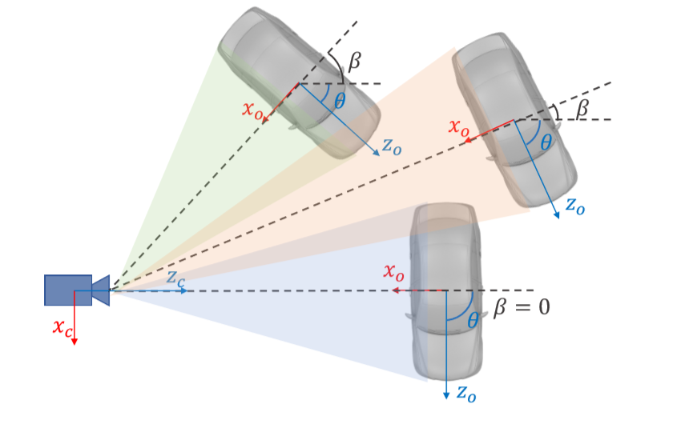
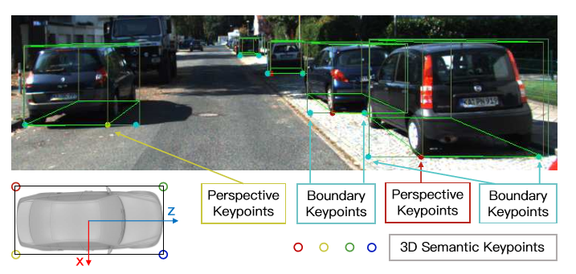

# Stereo-RCNN-based 3D-Object-Detection-for-Autonomous-Driving
It is implemented from Faster RCNN.
<b>R-CNN -> Fast R-CNN -> Faster R-CNN</b>

 <b><li>RCNN (Region Convolutional Neural Network):</li></b>
it has three seperate models, first for extracting image features, second for classify with SVM(Support Vector Machine), third for tighten boundbox with regressor.
1. 
   (a) Input images
   
   (b) extract Region proposals
   
   (c) compute CNN features
2. Classify Regions(using SVM)
3. Bounding box(Runs simple linear regression in regional proposal to generate a tighter bounding box coordinates)

 <b><li>Fast RCNN</li></b>
This approach is similar to the R-CNN algorithm. But, instead of feeding the region proposals to the CNN, we feed the input image to the CNN to generate a convolutional feature map. From the convolutional feature map, we identify the region of proposals and warp them into squares and by using a RoI pooling layer we reshape them into a fixed size so that it can be fed into a fully connected layer. From the RoI feature vector, we use a softmax layer to predict the class of the proposed region and also the offset values for the bounding box.

<b><li> Faster R-CNN</li></b>
the image is provided as an input to a convolutional network which provides a convolutional feature map. Instead of using selective search algorithm on the feature map to identify the region proposals, a separate network is used to predict the region proposals. The predicted region proposals are then reshaped using a RoI pooling layer which is then used to classify the image within the proposed region and predict the offset values for the bounding boxes.

1. In the first step, the input image goes through a convolution network which will output a set of convlutional feature maps on the last convolutional layer:

2. Then a sliding window is run spatially on these feature maps. The size of sliding window is n×n (here 3×3). For each sliding window, a set of 9 anchors are generated which all have the same center (xa,ya) but with 3 different aspect ratios and 3 different scales as shown below. Note that all these coordinates are computed with respect to the original image.

Furthermore, for each of these anchors, a value p∗ is computed which indicated how much these anchors overlap with the ground-truth bounding boxes.

p* is 1 if IoU > 0.7

p* is 0 if IoU < 0.3
  
where IoU is intersection over union and is defined below:

IoU= (Anchor ∩ GTBox)/ (Anchor ∪ GTBox)

3. Finally, the 3×3 spatial features extracted from those convolution feature maps (shown above within red box) are fed to a smaller network which has two tasks: classification (cls) and regression (reg). The output of regressor determines a predicted bounding-box (x,y,w,h), The output of classification sub-network is a probability p indicating whether the predicted box contains an object (1) or it is from background (0 for no object).

<b><li>Stereo RCNN</li></b>
With Stereo RCNN there are two other popular methods for 3D object detection but why stereo then ?
1. LiDAR-based 3D Object Detection : Currently, most of the 3D object detection methods heavily rely on LiDAR data for providing accurate depth information in autonomous driving scenarios. However, LiDAR has the disadvantage of high cost, relatively short perception range (∼100 m). Gaint companies like Tesla uses this method, this costs 50% of car's cost. But Stereo RCNN method costs only  5% of car's cost.

2. Monocular-based 3D Object Detection :  monocular camera provides alternative low-cost solutions for 3D object detection. The depth information can be predicted by semantic properties in scenes and object size, etc. However, the inferred depth cannot guarantee the accuracy, especially for unseen scenes. It uses one camera.

Stereo RCNN based 3D Object Detection :  Comparing with monocular camera, stereo camera provides more precise depth information by left-right photometric alignment. Comparing with LiDAR, stereo camera is low-cost while achieving comparable depth accuracy for objects with non-trivial disparities. The perception range of stereo camera depends on the focal length and the baseline. It uses two or more cameras. Its kind of seeing with one eye(monocular) and seeing with two or more eyes(stereo).  

Lets look how it works:

Main part we are going to discuss in this network are:
<li>Stereo R-CNN Network</li>
<li>Stereo RPN</li> 
<li>Stereo R-CNN</li>

                1. Stereo Regression
                
                2. Keypoint Prediction  
                
<li>3D Box Estimation</li>
<li>Dense 3D Box Alignment</li>

<b>Stereo R-CNN Network</b>
Stereo R-CNN can simultaneously detect and associate 2D bounding boxes for left and right images with minor modifications. We use weight-share ResNet-101 and FPN as our backbone network to extract consistent features on left and right images. It outpups feature maps.
ResNet-101 : Residual Network, which contains 101 layers.
FPN        : Feature Pyramid Network

<b>Stereo RPN</b>
Region Proposal Network (RPN) is a slidingwindow based foreground detector. After feature extraction,a 3 X 3 convolution layer  is utilized to reduce channel, followed by two sibling fully-connected layer to classify objectness and regress box offsets for each input location which is anchored with pre-define multiple-scale boxes. we concatenate left and right feature maps at each scale, then we feed the concatenated features into the stereo RPN network.  

<b>Stereo R-CNN :</b>
1.Stereo Regression: After stereo RPN, we have corresponding left-right proposal pairs. We apply RoI Align on the left and right feature maps respectively at appropriate pyramid level. The left and right RoI features are concatenated and fed into two sequential fully-connected layers (each followed by a ReLU layer) to extract semantic information. We use four sub-branches to predict object class, stereo bounding boxes, dimension, and viewpoint angle respectively.

 we use θ to denote the vehicle orientation respecting to the camera frame, and β to denote the object azimuth respecting to the camera center. Three vehicles have different orientations, however, the projection of them are exactly the same on cropped RoI images. We therefore regress the viewpoint angle α defined as: α = θ + β. To avoid the discontinuity, the training targets are [sinα,cosα] pair instead of the raw angle value.
 
With stereo boxes and object dimension, the depth information can be recovered intuitively, and the vehicle orientation can also be solved by decoupling the relations between the viewpoint angle with the 3D position. 

2. Keypoint Prediction :  Besides stereo boxes and viewpoint angle, we notice that the 3D box corner which projected in the box middle can provide more rigorous constraints to the 3D box estimation.

 we define four 3D semantic keypoints which indicate four corners at the bottom of the 3D bounding box. There is only one 3D semantic keypoint can be visibly projected to the box middle (instead of left or right edges). We define the projection of this semantic keypoint as perspective keypoint.
 
 <b>3D Box Estimation</b>
 we solve a coarse 3D bounding box by utilizing the sparse keypoint and 2D box information. States of the 3D bounding box can be represented by x = {x,y,z,θ}, which denotes the 3D center position and horizontal orientation respectively. Given the left-right 2D boxes, perspective keypoint, and regressed dimensions, the 3D box can be solved by minimize the reprojection error of 2D boxes and the keypoint.
 
  we extract seven measurements from stereo boxes and perspective keypoints: z = {ul,vt,ur,vb,u′ l,u′ r,up}, which represent left, top, right, bottom edges of the left 2D box, left, right edges of the right 2D box, and the u coordinate of the perspective keypoint.

vt = (y − h 2)/(z − w 2 sinθ − l 2cosθ),  
ul = (x − w 2 cosθ − l 2sinθ)/(z + w 2 sinθ − l 2cosθ),   
up = (x + w 2 cosθ − l 2sinθ)/(z − w 2 sinθ − l 2cosθ),   
u′r = (x − b + w 2 cosθ + l 2sinθ)/(z − w 2 sinθ + l 2cosθ).
